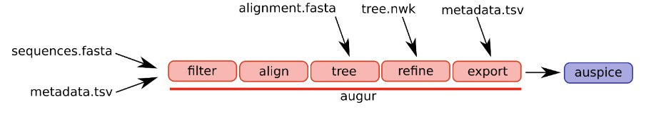
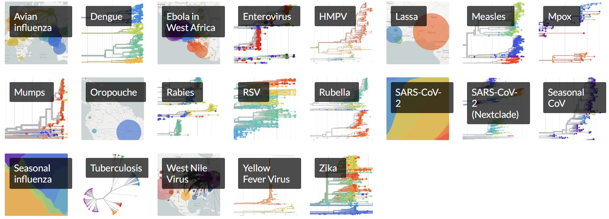
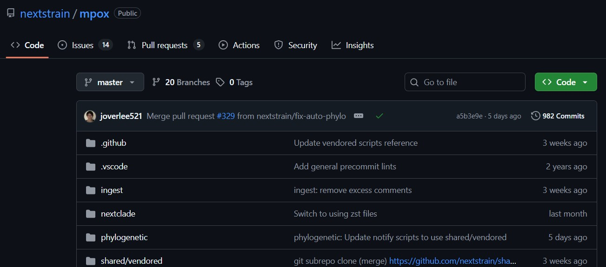
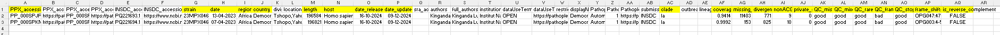
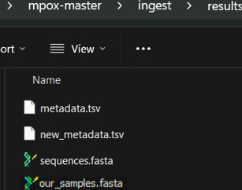
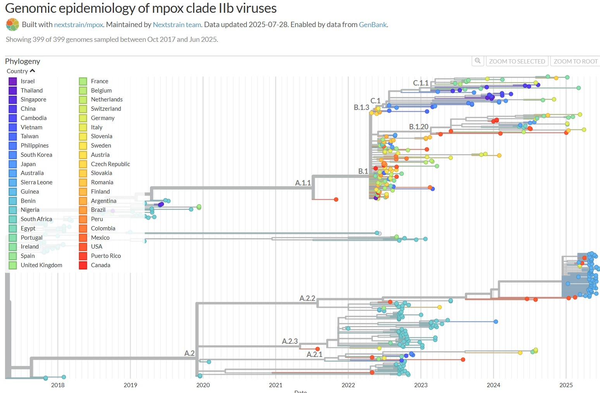

While phylogenetic and phylodynamic trees both depict evolutionary relationships, phylodynamic trees incorporate temporal information and epidemiological models to understand how evolutionary patterns arise in the context of time and population dynamics, often using time-scaled trees.

We can apply the [augur](https://docs.nextstrain.org/projects/augur/en/stable/) pipeline on [Nextstrain](https://docs.nextstrain.org/en/latest/index.html) to generate these timetrees. Augur is composed of a series of modules and different workflows which use different parts of the pipeline. A selection of the different input and output files are illustrated below.



Nextstrain maintains analyses of several selected [pathogens](https://nextstrain.org/pathogens#list), such as SARS-CoV-2 and influenza to show pathogen evolution and epidemic spread. Nextstrain continually update sequencing data for selected pathogens as new data is made publicly available. Automated pipelines are available for the following viral targets:



## Nextstrain - pre-set automated pipeline

Please follow the steps for running an automated pipeline for the above pre-set targets on Nextstrain [here](https://docs.nextstrain.org/en/latest/install.html).

<strong style="color:darkblue">For the purpose of this guide, we will now follow an example automated workflow for mpox</strong>

It would be a good idea to have all our Nextstrain builds in the same folder. Please create one now if you have not already done so.

``` bash
cd /mnt/viro0002-data/sequencedata/processed/Diagnostics_metagenomics/
mkdir Nextstrain_builds
```

You also need to be in the right environment:

``` bash
conda deactivate nanopore_diagnostics
```

``` bash
conda activate nextstrain2025
```

### Download the references

You first need to go to the Nextstrain github page for your virus of interest. We will use  [mpox](https://github.com/nextstrain/mpox/tree/master?tab=readme-ov-file) as an example.

 Click **Code** and then **Download ZIP**. This zip contains all your scripts you need for the pipeline.

Now extract and save your zipped file (in this case **mpox-master**) in our newly created folder **Nextstrain_builds**.

::: callout-warning
## Warning

Some pipelines may require certain dependencies, you may need to check requirements on the github page of your target of interest. Our environment **nextstrain2025** should include most of the tools you require. 
:::


You now need to download all the curated reference sequences (these sequences are continually updated as new sequences become available). As the scripts contained in **mpox-master** assume you are within the ingest directory, please copy the following command:

``` bash
cd /mnt/viro0002-data/sequencedata/processed/Diagnostics_metagenomics/Nextstrain_builds/mpox-master/ingest/
```

## Ingest pipeline

Next you will run the "ingest" pipeline. The ingest pipeline in Nextstrain "fetches" all the curated reference sequences and then filters, standardizes and outputs cleaned fasta and metadata files named "sequences.fasta" and "metadata.tsv". These are your input files for the next pipeline. The "ambient" flag allows the command to run outside of any container image or managed environment.

``` bash
nextstrain build --ambient .
```

::: callout-important
## Important

Check these two files have been created.
:::

``` bash
cd /mnt/viro0002-data/sequencedata/processed/Diagnostics_metagenomics/Nextstrain_builds/mpox-master/ingest/results/
ls
```

### Now its time to add your sequences and metadata

(i) First add your individual **fasta** sequence(s) of interest to the "/mnt/viro0002-data/sequencedata/processed/Diagnostics_metagenomics/Nextstrain_builds/mpox-master/ingest/results/" folder. The sequence name and file name should match. To check the sequence name, open with bioedit, Aliview or notepad.

(ii) You next need to combine your downloaded reference fasta file from the ingest step (named **sequences.fasta**) with your sequence(s) of interest (this should be called **our_samples.fasta**). All your sequence(s) of interest should be in this file.  

``` bash
cd /mnt/viro000-data/sequencedata/processed/Diagnostics_metagenomics/Nextstrain_builds/mpox-master/ingest/results/
cat our_samples.fasta >> sequences.fasta
```

::: callout-tip
## Tip

Remember **cat** just means concatenate.
:::

(iii) You also need to combine your downloaded reference metadata file from the ingest step (**metadata.tsv**) with the metadata of your sequence(s) of interest. 

The following image offers an example of the metadata layout. In the columns highlighted, please provide data. You should find this example file named **new_metadata.excel** in the Nextstrain builds folder. 



::: callout-warning
## Warning

Remember to delete the pre-existing data in row two of the excel file (this is just an example) and replace with your own metadata!
:::

::: callout-tip
## Tip

The "strain" name should match the fasta file (e.g sample number). If the accession number is unknown, just use the same name as the "strain". If the "date_released" and "date_updated" are unknown, just use the sampling date and then the date of this analysis. For fields such as clade, coverage and nonACGTN, please upload the sequences onto [Nextclade](https://clades.nextstrain.org/). Just drag and drop the consensus sequences and select the right reference database (in this case mpox).
:::

Save the excel sheet as "new_metadata.txt" (tab-delimited) in the "/mnt/viro0002-data/sequencedata/processed/Diagnostics_metagenomics/Nextstrain_builds/mpox-master/ingest/results/" folder then change the file extension to **tsv**.

Now run the following command to combine the metadata files:

``` bash
tail -n +2 new_metadata.tsv >> metadata.tsv
```

🔹<strong style="color:darkblue">--tail -n +2</strong> – skips the first line (header) of the new file.

Below you can see an example of the files:



### Forcing sequence inclusion

The pipeline works by pruning sequences of low quality or subsampling if many sequences are run at the same time. You can force the pipeline to include your sequences of interest. This option is integrated within the snakemake. A file can be found within the default folder of the specific (clade) build you will generate. In our case we will focus on all clades.     

Please go to this location:

``` bash
cd /mnt/viro0002-data/sequencedata/processed/Diagnostics_metagenomics/Nextstrain_builds/mpox-master/phylogenetic/defaults/mpox/
ls
```

Just add all the **strain** names from your sequence(s) of interest to the **include.txt** file (one sequence name per line) and save. 


### Additional contig file

Some workflows on Nextstrain require an additional config file to update parameters or point towards a particular folder. The following config file can be used for all Nextstrain builds. Copy over **my-inputs.yaml** from the Nextstrain_builds folder into the phylogenetic folder (in this case we are using mpox-master). 

``` bash
cp /mnt/viro0002-data/sequencedata/processed/Diagnostics_metagenomics/Nextstrain_builds/my-inputs.yaml /mnt/viro0002-data/sequencedata/processed/Diagnostics_metagenomics/Nextstrain_builds/mpox-master/phylogenetic/
```
### Phylogenetic pipeline

Make sure you are in the right folder:

``` bash
cd /mnt/viro0002-data/sequencedata/processed/Diagnostics_metagenomics/Nextstrain_builds/mpox-master/phylogenetic/
```

Now just run the following command. The phylogenetic pipeline uses the cleaned fasta and metadata from ingest, aligns sequences, builds and refines a phylogenetic tree, annotates it with traits or mutations, and outputs an Auspice JSON ready for interactive visualization. The config file used is for all mpox strains, please see the tip box below for alternative clades.

``` bash
nextstrain build --ambient . --configfiles defaults/mpxv/config.yaml my-inputs.yaml
```

::: callout-tip
## Tip
Run pipeline to produce the "overview" tree for /mpox/all-clades with:
nextstrain build . --configfile defaults/mpxv/config.yaml

Run pipeline to produce the "clade IIb" tree for /mpox/clade-IIb with:
nextstrain build . --configfile defaults/hmpxv1/config.yaml

Run pipeline to produce the "lineage B.1" tree for /mpox/lineage-B.1 with:
nextstrain build . --configfile defaults/hmpxv1_big/config.yaml

Run pipeline to produce the "clade I" tree for /mpox/clade-I with:
nextstrain build . --configfile defaults/clade-i/config.yaml
:::

::: callout-important
## Important

You may run out of memory, just re-run again.
:::

Just let the script run.

### Visualization

Once the script has finished, please run the following command. This will open your phylodynamic tree on a web browser for visualization. Any problems, just drag and drop the **mpox_all-clades.json** file (within the **auspice** folder) onto this [link](https://auspice.us/). Auspice allows an interactive exploration of phylogenomic datasets by simply dragging & dropping.  

``` bash
nextstrain view --ambient .
```

Use the filter to find your sequences (zoom into the tree by clicking branches). Play around with the different metadata fields (e.g. country, genotype etc.), tree layouts and branch lengths (time and divergence).



::: callout-important
## Important

Remember to update all paths for each target or sequence of interest!
:::

## Nextstrain - creating your own pipeline

If your selected target is not available, don't worry! It will take a little bit more effort, but we can make our own pipeline. For more information click [here](https://docs.nextstrain.org/en/latest/tutorials/creating-a-phylogenetic-workflow.html#run-a-nextstrain-build)

There are quite a few commands in the pipeline so lets break it up!

**For the purpose of this guide, we will again use rhinovirus A as a study virus.**

::: callout-warning
## Warning

Make sure you have read through and completed any tasks in the **Preparation and Reference collection** chapter!
:::

You first need to be in the right environment

``` bash
conda activate nextstrain2025
```

While a Snakemake workflow could be created, the parameters often vary between pathogens. For now, this step is performed ad hoc (**and within your sample folder of interest**).

We will now add an additional folder for Nextstrain within your barcode of interest.

``` bash
cd /mnt/viro0002-data/sequencedata/processed/Diagnostics_metagenomics/Viro_Run_0001/barcode01/
mkdir Nextstrain
```

::: callout-important
## Important

All your input files should be in this folder. If you have also created a phylogenetic tree in the previous chapter, your input sequences and metadata file will be in the folder "Tree". You need to move them into the new "Nextstrain" folder!
:::

### Make sure you are in the right path

``` bash
cd /mnt/viro0002-data/sequencedata/processed/Diagnostics_metagenomics/Viro_Run_0001/barcode01/Nextstrain/
```

### Indexing

This step prepares your input sequences by indexing them, making it easier and faster for downstream tools to look up and access specific entries efficiently.

``` bash
augur index --sequences RVA_sequences.fasta –output index.tsv
```

🔹<strong style="color:darkblue">--sequences RVA_sequences.fasta</strong> – Input FASTA file containing RVA sequences.

🔹<strong style="color:darkblue">--output index.tsv</strong> – Generates an indexed TSV file of the sequences for downstream reference.

### Aligning

Aligns all your sequences to a common reference frame so that they’re directly comparable, base by base. This is necessary for identifying mutations and building a phylogenetic tree.

``` bash
augur align --sequences RVA_sequences.fasta --output sequences_aligned.fasta --fill-gaps
```

🔹<strong style="color:darkblue">--sequences RVA_sequences.fasta</strong> – Input unaligned nucleotide sequences.

🔹<strong style="color:darkblue">--output sequences_aligned.fasta</strong> – Output aligned sequences in FASTA format.

🔹<strong style="color:darkblue">--fill-gaps</strong> – Fills internal alignment gaps with reference characters for consistency.

::: callout-important
## Important

Always check the alignment file (using bioedit or aliview). You may need to remove reference sequences which are problematic. Remember to **also** remove or update these references in the metadata.tsv file and re-run the alignment.
:::

### Generating a raw tree

Constructs a basic phylogenetic tree from the aligned sequences using a selected algorithm (e.g., IQ-TREE). This tree shows the relationships between sequences based on their similarity.

``` bash
augur tree --alignment sequences_aligned.fasta --output tree_raw.nwk --substitution-model GTR+G --method iqtree --nthreads 16
```

🔹<strong style="color:darkblue">--alignment sequences_aligned.fasta</strong> – Input aligned FASTA file.

🔹<strong style="color:darkblue">--output tree_raw.nwk</strong> – Outputs a raw tree in Newick format.

🔹<strong style="color:darkblue">--substitution-model GTR+G</strong> – Sets the substitution model to General Time Reversible with Gamma-distributed rate variation.

🔹<strong style="color:darkblue">--method iqtree</strong> – Uses IQ-TREE as the inference engine.

🔹<strong style="color:darkblue">--nthreads 16</strong> – Allocates 16 CPU threads.

::: callout-tip
## Tip

The substitution-model may need to be updated depending on the test or target. GTR+G is a typical model used.
:::

### Refining the tree

This is one of the most important steps. It improves the initial tree by:

-Calibrating it against sample collection dates to build a time-scaled phylogeny.

-Correcting uncertain or poor-quality branches.

-Estimating how the sequences evolved over time.

-Incorporating metadata to enrich tree interpretation

``` bash
augur refine --tree tree_raw.nwk k --alignment sequences_aligned.fasta --metadata meta_data.tsv --output-tree tree.nwk --output-node-data branch_lengths.json --timetree --coalescent skyline --covariance --precision 3 --date-confidence --date-inference marginal --branch-length-inference auto --clock-filter-iqd 0 --divergence-unit mutations-per-site --stochastic-resolve
```

🔹<strong style="color:darkblue">--tree tree_raw.nwk</strong> – Input raw tree.

🔹<strong style="color:darkblue">--alignment sequences_aligned.fasta</strong> – Same alignment used in tree generation.

🔹<strong style="color:darkblue">--metadata meta_data.tsv</strong> – Sample metadata file with collection dates, genotypes, etc.

🔹<strong style="color:darkblue">--output-tree tree.nwk</strong> – Refined tree output.

🔹<strong style="color:darkblue">--output-node-data branch_lengths.json</strong> – Stores branch length data for visualization.

🔹<strong style="color:darkblue">--timetree</strong> – Converts the tree into a time-resolved tree using sample dates.

🔹<strong style="color:darkblue">--coalescent skyline</strong> – Uses a skyline coalescent model for demographic inference.

🔹<strong style="color:darkblue">--covariance</strong> – Enables covariance-aware date inference.

🔹<strong style="color:darkblue">--branch-length-inference auto</strong> – Lets Augur choose best branch length method.

🔹<strong style="color:darkblue">--clock-filter-iqd 0</strong> – Filters outlier sequences by interquartile deviation (set to 0 to disable).

🔹<strong style="color:darkblue">--divergence-unit mutations-per-site</strong> – Units used for tree scale.

🔹<strong style="color:darkblue">--stochastic-resolve</strong> – Randomly resolves polytomies for better visualization.

::: callout-important
## Important

Depending on the target or test, you may need to update these parameters.
:::

#### Additional help with selecting parameters for the “refine” step:

🔹 <strong style="color:darkblue">--coalescent</strong> – This models how the tree should behave in time:

skyline: assumes population size changes over time (flexible, good for outbreaks).

constant: assumes a constant population size over time.

Use skyline if you expect varying infection rates or changing sampling over time.

 

🔹 <strong style="color:darkblue">--branch-length-inference</strong> – Controls how the branch lengths (evolutionary distances) are interpreted:

auto: lets Augur decide the best method.

joint: all branch lengths are estimated together for best overall fit.

marginal: branch lengths are optimized one node at a time (faster, less precise).

Stick with auto unless you're troubleshooting.

 

🔹 <strong style="color:darkblue">--clock-filter-iqd</strong> – This removes outlier sequences that don’t fit the molecular clock:

Value of 0 disables it. Use 0 when you see strange branching or inconsistent sample dates.

Typical values: 2 or 4 to exclude sequences with timing or mutation issues.

 

🔹 <strong style="color:darkblue">--precision</strong> – Controls numeric rounding (e.g., for branch lengths, mutation counts):

3 is standard (0.001 resolution).

You can increase to 5 for greater detail, or lower for simplicity.

 

### Adding traits

Maps sample metadata (like genotype or country) onto the tree to track how traits evolve or spread over time and geography. Useful for epidemiological insights.

``` bash
augur traits --tree tree.nwk --metadata meta_data.tsv --columns genotype country --output-node-data traits.json –confidence
```

🔹<strong style="color:darkblue">--tree tree.nwk</strong> – Input refined tree.

🔹<strong style="color:darkblue">--metadata meta_data.tsv</strong> – Metadata with traits (like genotype or country).

🔹<strong style="color:darkblue">--columns genotype country</strong> – Traits to be inferred and displayed.

🔹<strong style="color:darkblue">--output-node-data traits.json</strong> – Outputs node trait information.

🔹<strong style="color:darkblue">--confidence</strong> – Adds confidence estimates for trait assignment.

::: callout-warning
## Warning

Traits are extracted from the metadata.tsv file. In this example, the traits used are genotype and country, which must exist as columns in your metadata file. Be sure to update the command to match the columns available in your own metadata.tsv.
:::

### Adding mutation data

Infers what the ancestral sequences probably looked like at each node of the tree and what mutations occurred along each branch (at the nucleotide level).

``` bash
augur ancestral --tree tree.nwk --alignment sequences_aligned.fasta --output-node-data nt_muts.json --inference joint
```

🔹<strong style="color:darkblue">--tree tree.nwk</strong> – Refined tree input.

🔹<strong style="color:darkblue">--alignment sequences_aligned.fasta</strong> – Aligned sequences.

🔹<strong style="color:darkblue">--output-node-data nt_muts.json</strong> – Outputs inferred nucleotide mutations.

🔹<strong style="color:darkblue">--inference joint</strong> – Uses joint inference (best for overall consistency).

### Adding protein data

Converts inferred nucleotide mutations into amino acid changes (protein mutations), which are often more biologically meaningful.

``` bash
augur translate --tree tree.nwk --ancestral-sequences nt_muts.json --reference-sequence FJ445111.gb --output-node-data aa_muts.json
```

🔹<strong style="color:darkblue">--tree tree.nwk</strong> – Phylogenetic tree.

🔹<strong style="color:darkblue">--ancestral-sequences nt_muts.json</strong> – File with nucleotide mutations.

🔹<strong style="color:darkblue">--reference-sequence FJ445111.gb</strong> – GenBank reference for translation. In our case, FJ445111.gb is for RVA. Remember to update!

🔹<strong style="color:darkblue">--output-node-data aa_muts.json</strong> – Outputs amino acid mutations.

::: callout-important
## Important

Remember to update the reference gb sequence. This is typically a root or prototype strain—such as the Fermon strain for EV-D68 or the Wuhan reference strain for SARS-CoV-2. If unsure, use an official curated reference from RefSeq. Place the gb sequence in the same folder before running the command.
:::

### Exporting

Packages all tree, metadata, mutation and trait data into a .json file that can be visualized using Auspice, the interactive Nextstrain viewer

``` bash
augur export v2 --tree tree.nwk --metadata meta_data.tsv --node-data branch_lengths.json traits.json nt_muts.json aa_muts.json --output final_output.json --color-by-metadata genotype country
```

🔹<strong style="color:darkblue">--tree tree.nwk</strong> – Tree file for final visualization.

🔹<strong style="color:darkblue">--metadata meta_data.tsv</strong> – Sample metadata.

🔹<strong style="color:darkblue">--node-data ...</strong> – Adds all prior data files (traits, mutations and branch lengths).

🔹<strong style="color:darkblue">--output final_output.json</strong> – Combined JSON for Auspice visualization.

🔹<strong style="color:darkblue">--color-by-metadata genotype country</strong> – Defines traits for coloring in the final tree.

::: callout-warning
## Warning

--color-by-metadata parameter must match your metadata.tsv file. The example includes "genotype" and "country". These must be columns present in your metadata.tsv file.
:::

### Visulization

Follow this [link](https://auspice.us/) to open auspice. Auspice allows an interactive exploration of phylogenomic datasets by simply dragging & dropping.

Drag and drop the **final_output.json** file onto the webpage. This file contains all your sequencing and metadata.


Use the filter to find your sequences (zoom into the tree by clicking branches). Play around with the different metadata fields (e.g. country, genotype etc.), tree layouts and branch lengths (time and divergence).

::: callout-tip
## Tip

If the tree doesn’t appear accurate, you may need to spend more time adjusting the reference sequences or fine-tuning the parameters.
:::

If you scroll to the end of aupice, you will also see the nucleotide diversity per site.


<strong style="color:darkblue">You now have your phylodynamic tree!</strong>
